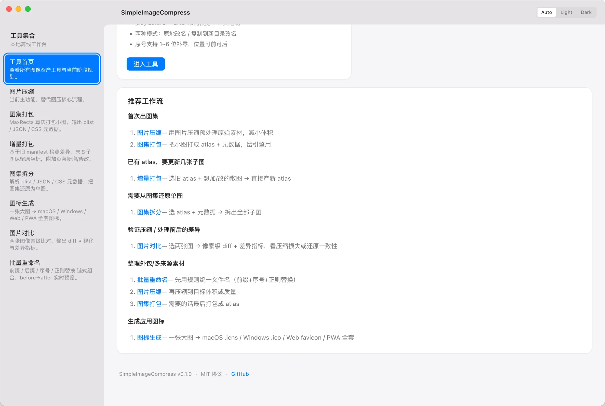
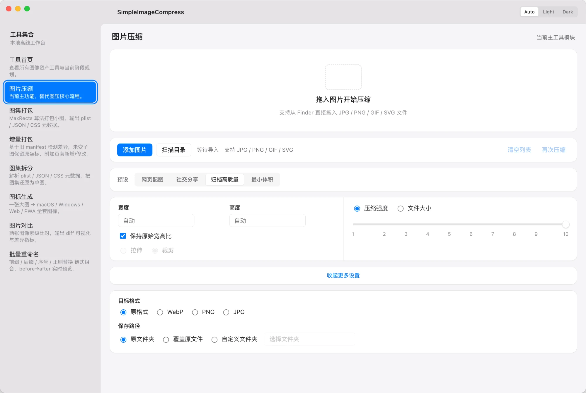
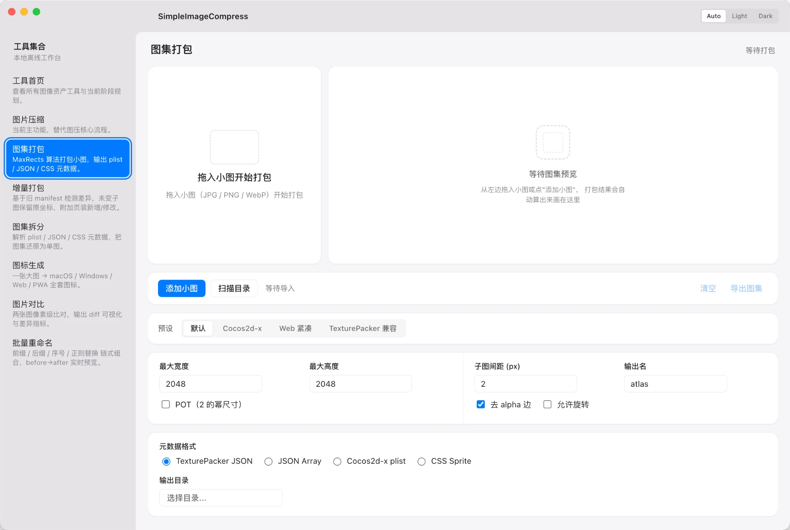
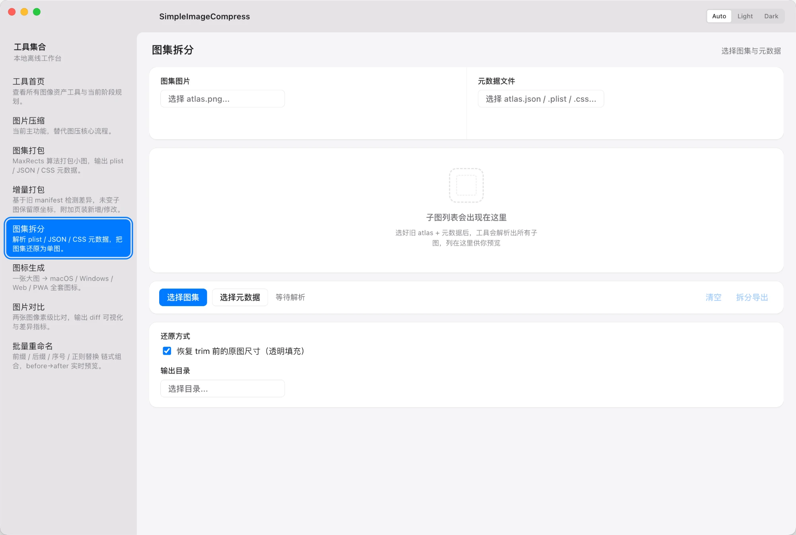
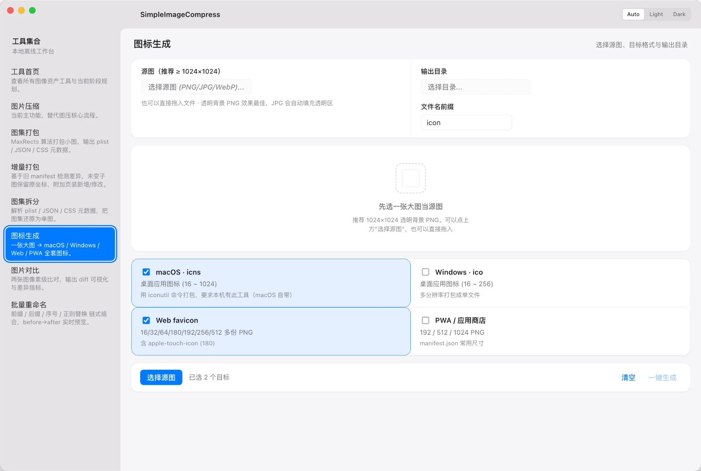

# SimpleImageCompress

[](./LICENSE)
[](#mac-打包)
[](https://github.com/fengzhouxuan/simpleTools/actions/workflows/test.yml)

SimpleImageCompress 当前是一个纯本地的桌面图片压缩工具原型，但产品最终目标不是“单一压图工具”，而是一个面向美术与资源处理流程的图像资产工具集合。

## 截图

<table>
  <tr>
    <td width="50%" align="center">
      <a href="docs/screenshots/01-home.png">
        
      </a>
      <br><sub><b>工具首页</b> — 9 个工具入口 + 推荐工作流 + 主题切换</sub>
    </td>
    <td width="50%" align="center">
      <a href="docs/screenshots/02-compress.png">
        
      </a>
      <br><sub><b>图片压缩</b> — 4 个预设 + 质量/目标体积两种模式</sub>
    </td>
  </tr>
  <tr>
    <td width="50%" align="center">
      <a href="docs/screenshots/03-atlas-pack.png">
        
      </a>
      <br><sub><b>图集打包</b> — MaxRects 算法 + 实时预览 + 4 种元数据格式</sub>
    </td>
    <td width="50%" align="center">
      <a href="docs/screenshots/04-atlas-unpack.png">
        
      </a>
      <br><sub><b>图集拆分</b> — 解析 plist/JSON/CSS 元数据，还原单图</sub>
    </td>
  </tr>
  <tr>
    <td colspan="2" align="center">
      <a href="docs/screenshots/05-icon-gen.png">
        
      </a>
      <br><sub><b>图标生成</b> — 一张大图 → macOS .icns / Windows .ico / Web favicon / PWA 全套</sub>
    </td>
  </tr>
</table>

长期形态会逐步扩展为：

- 图片压缩
- 图集打包
- 图集增量打包
- 图集拆分
- 其他围绕图片资源加工的离线工具

这份 README 只保留“快速进入项目”所需的信息。  
如果要接手开发、定位功能、继续迭代，请先看：

- [docs/DEVELOPMENT.md](/Users/wepie/Documents/Github/SimpleImage/docs/DEVELOPMENT.md)

## 当前能力

- Electron + TypeScript + Preact + Vite 桌面应用
- 同时提供 **CLI 模式**（`simpleimage <command>`）走纯 Node，可集成到 shell / make / CI
- 明亮 SaaS 风格 UI（靛蓝主色 + 渐变 + 白卡片浮起，主题手动切换 auto/light/dark，本地 Plus Jakarta Sans / Inter 字体离线可用）
- 应用菜单：Cmd+1~9 切工具，Cmd+Enter 触发当前工具主操作
- 全局通知 (toast) + 流式进度条 + 错误边界隔离工具崩溃
- 工具首页 dashboard：能力卡片 + 推荐工作流 + GitHub 链接
- 按工具隔离的 state；输出目录、主题等偏好自动持久化
- 批量任务并发（默认 4 worker），多核 CPU 充分利用
- 本地文件选择、输出目录选择
- 拖拽导入与目录递归扫描（自动跳过隐藏文件与 node_modules 等大目录）
- JPG / PNG / GIF 压缩
- SVG 优化
- JPG / PNG / GIF 目标大小压缩
- JPG / PNG 导出为 WebP / JPG / PNG
- 原文件夹 / 覆盖原文件 / 自定义文件夹 保存路径策略
- 4 个内置压缩预设（网页配图 / 社交分享 / 归档高质量 / 最小体积）+ 自定义检测
- GIF/SVG 兼容性预防提示（选错输出格式即时告警 + 一键修复）
- 压缩结果列表显示前后大小对比、打开文件、Finder 显示、失败重试
- 图集打包（MaxRects 算法）：实时预览、参数面板、4 种元数据格式（Cocos2d-x plist / TexturePacker JSON Hash / JSON Array / CSS Sprite）、支持 trim / rotate / POT / 多页输出
- 图集拆分：解析 plist / JSON / CSS 元数据，把图集还原为单图，支持 trim/rotate 还原
- 图集增量打包（merge 模式）：拆开旧图集 + 合并新散图（新散图按文件名覆盖同名旧子图） → 全量重打成一张新图集，输入只要旧 atlas + 旧元数据 + 想加/改的散图
- 图标生成：一张大图 → macOS `.icns` / Windows `.ico` / Web favicon / PWA 全套图标，macOS 走系统自带 `iconutil`
- 图片对比：两张图像素级 diff，红色高亮不同处 + 差异指标（不同像素数 / 占比 / 最大单通道差），尺寸不同自动 contain 缩放再比对
- 批量重命名：前缀 / 后缀 / 序号补零 / 正则替换 链式组合，before→after 实时预览 + 冲突检测，支持原地改名或复制到新目录改名
- 元数据剥离：批量去除 EXIF / GPS / IPTC / XMP 等隐私信息，JPG 走 mozjpeg + 95 质量重编码（肉眼几乎无损），可选保留 ICC profile 与 EXIF Orientation
- 九宫格裁切：大图按 9-slice 切分点裁掉中间冗余 → 输出极小代表小图 + .9slice.json 元数据；4 个 inset 独立可为 0 自动支持 3-slice 横/竖；实时显示输出尺寸 / 节省比 / 还原误差

## 环境要求

- macOS
- Node.js 20+
- npm 10+
- 本地可用 `iconutil`（macOS 自带，用于生成 `.icns`）

## 快速开始

```bash
npm install
npm run dev
```

开发模式会同时启动 Vite 和 Electron。

## CLI 模式（无 GUI）

```bash
# 直接用 npm script
npm run cli -- compress path/to/*.png --preset web --output out/

# 或 node 直跑
node bin/cli.cjs compress path/to/*.png --preset web --output out/

# 装到 PATH 后（npm install --global / npm link）
simpleimage compress path/to/*.png --preset web --output out/
```

支持全部 6 个可命令化工具：`compress / atlas-pack / atlas-unpack / icon-gen / image-diff / batch-rename`。`simpleimage --help` 看完整参数。CLI 用纯 Node 跑，不拉 Electron 进程，启动快、适合脚本集成。

> 元数据剥离、九宫格裁切、图集增量打包暂未提供 CLI。前两个结构简单已规划补齐，后者依赖 GUI 拆图缓存。

## 构建与本地验证

```bash
npm run build
npm start
```

`npm start` 会直接加载 `dist/index.html`，适合本地验证构建结果。

## Mac 打包

生成图标资源：

```bash
npm run assets:icons
```

生成本地 `.app` 目录：

```bash
npm run pack:mac
```

生成可分发的 `.dmg` 和 `.zip`：

```bash
npm run dist:mac
```

当前产物默认输出到 `release/`，例如：

- `release/mac-arm64/SimpleImageCompress.app`
- `release/SimpleImageCompress-0.1.0-arm64.dmg`
- `release/SimpleImageCompress-0.1.0-arm64.zip`

补充说明：

- 当前已能完成本地签名和打包
- 当前未配置 notarization，所以是“可本地分发测试”的版本，不是完整的公网发行版

## 文档索引

- [docs/USAGE.md](/Users/wepie/Documents/Github/SimpleImage/docs/USAGE.md): 用户使用指南，每个工具的典型流程 / 参数含义 / 常见坑
- [docs/DEVELOPMENT.md](/Users/wepie/Documents/Github/SimpleImage/docs/DEVELOPMENT.md): 开发交接文档，包含架构、关键模块、数据流、已知限制、后续建议
- [docs/ROADMAP.md](/Users/wepie/Documents/Github/SimpleImage/docs/ROADMAP.md): 已完成 / 明确不做 / 可做但未做 的状态总览，新加工具的位置约定

## 当前优先事项

四个核心工具（压缩 / 图集打包 / 图集拆分 / 图集增量打包）MVP 全部完成。剩余优先事项：

1. 增量打包累积"垃圾像素"过多时的全量重打回收
2. 接入 notarization 和正式发布流程
3. 大文件/长任务的流式进度反馈（目前批量任务只有整体 loading）

## 中长期方向

项目骨架已经按"工具首页 + 独立工具模块"组织。新增工具时遵循：

- 主进程：`electron/tools/<tool>.cjs` 单独模块，自行注册 `tools:<tool>:*` IPC 命名空间
- 渲染层：`src/tools/<tool>/` 子目录（view + state + 子组件），通用 UI 抽到 `src/components/`
- preload：`window.simpleImage.tools.<tool>.*` 命名空间暴露 API
